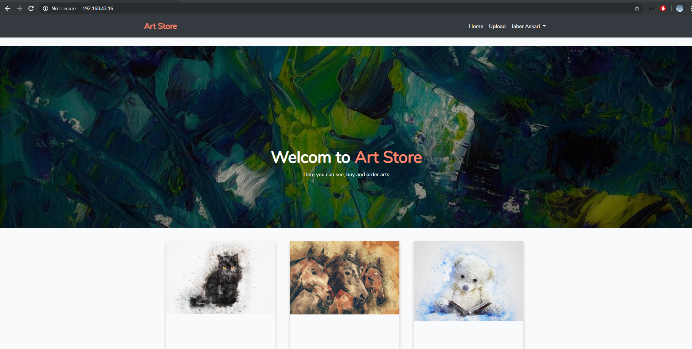
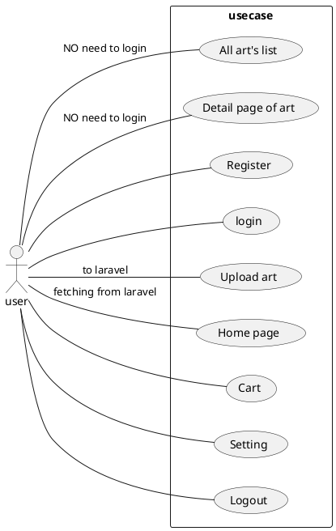
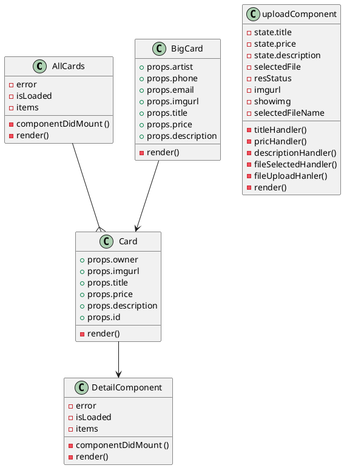

# Web-ohjelmointi and Web-palvelin ohjelmointi project


* Jaber Askari M2947
* Fall 2019 
* Version 1.00

## Link to youtube video
[

## Table of contents

* [Introduction](#introduction)
* [Project Description ](#project-description)
* [Database](#database)
* [General Features](#general-features)
* [Requirements, Usage and Features](#requirements-usage-and-features)
* [General Use Case(Actors, features)](#general-use-caseactors-features)
* [Class Diagram](#class-diagram)
* [Connecting React js to Laravel](#connecting-react-js-to-laravel)
* [Art store Interface](#art-store-interface)
* [Current Problems and Future Improvement](#current-problems-and-future-improvement)
* [What I have learned and challenges](#what-i-have-learned-and-challenges)
* [Self Grading](#self-grading)<br><br><br><br>

 <br>
# Introduction

As a combined project for web programming and web server programming courses I developed a web store for arts. Name of the application is Art Store. 
In Art store users can upload their personal arts with their description such as, title, price and  contact information in the website to sell. Users are able to make
an account in the store and add as much art
as they want in their personal account to sell or just simply to show it to other artists in the website and visitors.
Seeing all the arts picuturs and descriptions does not not require an account in the website, but uploading a new art is restricted only to users who have an active account.
This project is developed with React js for front end and PHP Laravel for back end.


# Project Description

Art store is meant for art lovers generally. Users without an account in the website 
can use it for seeing other arts, buying and getting their contact information. 
The front end of the project is made with React js. Each card for a art is a 
React component that is being used in another React component to load all the arts 
list from database. For getting information from server I used "fetch()" method and 
for sending data to the server I used the axios library in React and its post method. 
For storing the user's and art's information mysql database has been used and for 
storing the images the internal storage of Laravel has been used. The images is stored 
in Storage/public path to make sure that all the images have the right to be accessed from 
outside.


# Database

Myql is the database for storing data of users, arts, and transactions. 

In Mysql database there are 3 tables:
* users
* arts
* transactions

In picture below you can see the tables, columns, types and relationships of the database:


<br>

# General Features

|ID| Feature | Priority |Implementation|
| :-:| :-: | :-: | :-: |
| FT01 | Signing up into the web application with email address | Important | Implementated|
| FT02 | List of all arts in main page for all users | Important |Implementated |
| FT03 | Writing description for uploading art | Important |Implementated |
| FT04 | Setting a title for the art | Important |Implementated |
| FT05 | Setting a price for the art| Important |Implementated |
| FT06 | Seeing image, description, title, price and artist's information of art| Important |Implementated |
| FT07 | Adding arts to personal account| Important | Implementated |
| FT08 | Seeing user's personal arts list in home page| Important | Implementated |
| FT09 | Deleting the account from web application| Important | Not Implementated |
| FT11 | Changing personal information| Nice to have |Not Implementated |
| FT12 | Changing arts information| Nice to have |Not Implementated |
| FT13 | Deleting arts from account| Nice to have |Not Implementated |
| FT14 | Adding arts to cart| important |Not Implementated |


# Requirements, Usage and Features

## Implemented Functional Requirements

In the table below there are all the functional requirements that has been implemented in the project:


| RequirementD | Type | Description | 							
|:-:|:-:|:-:|
| FUNCTIONAL-REQ-C0001 | Functional Requirement | User can sign up to the service with his/her email address|
| FUNCTIONAL-REQ-C0002 | Functional Requirement | All Users can see all the Arts list in the main page  |
| FUNCTIONAL-REQ-C0003 | Functional Requirement | User can Add arts to his personal account|
| FUNCTIONAL-REQ-C0004 | Functional Requirement | User can set a title to the art|
| FUNCTIONAL-REQ-C0005 | Functional Requirement | User can set a price to the art|
| FUNCTIONAL-REQ-C0006 | Functional Requirement | User can write a description about his/her art|
| FUNCTIONAL-REQ-C0007 | Functional Requirement | User can See his personal arts in home page|
| FUNCTIONAL-REQ-C0008 | Functional Requirement | User can see the picture, title, price, description and artist's information of the art|


## Not Implemented Functional Requirements

In the table below is listed all the requirement which are not implemented in the application.


| RequirementD | Type | Description | 							
|:-:|:-:|:-:|
| FUNCTIONAL-REQ-C0001 | Functional Requirement | User can add arts the cart|
| FUNCTIONAL-REQ-C0002 | Functional Requirement | user can change his/her personal information|
| FUNCTIONAL-REQ-C0003 | Functional Requirement | User can change/delete the information of his/her arts|
| FUNCTIONAL-REQ-C0004 | Functional Requirement | User can delete his/her account|
| FUNCTIONAL-REQ-C0005 | Functional Requirement | User can buy arts|


## Non-Functional Requirements

### Security


| RequirementID | Type | Description | Features that is affected|								
|:-:|:-:|:-:|:-:|
| SECURITY-REQ-0001 | Non-Functional Security | The passwords are hashed and stored in the database|								


### Usability

| RequirementID | Type | Description | 							
|:-:|:-:|:-:|
| USABILITY-REQ-0001 | Non-Functional Usability | The user can use the service from phone of coumputer browser|
| USABILITY-REQ-0002 | Non-Functional Usability | The user interface and designing have proper contrasts in colors and is simple to navigate|


## Limitations to Consider

| Id | description | Category |
|:-:|:-:|:-:|
| CONSTRAINT-REQ-S00001 | Constrain | Project is developed in virtual machine, it is not accessable from outside of the host machine|
| CONSTRAINT-REQ-S00002 | Constrain | The server should always be connected under same LAN |


## General Use Case(Actors, features)



# Class Diagram

Front end React js class diagram: <br><br>



# Connecting React js to Laravel
For connecting React of Laravel and sending data to the server I user axios laibrary

<br><br>
Laravel/web.php
routing:
```php
    //uploads image to storage
    Route::post('/uploadfromreact', 'ReactController@uploadFromReact');
    
```
<br><br>

uploadcommponent
it uploads images and texts to server
```js

//method for sending image and text to server
 fileUploadHandler(e){

        e.preventDefault();
        //http request header
        const config = { headers: { 'Content-Type': 'multipart/form-data','X-CSRF-TOKEN': $('meta[name="csrf-token"]').attr('content') } };
        //creating a formdata to store data in it
        const fdata= new FormData;
        //appending all states to formdata to create a single package
        fdata.append('title',this.state.title);
        fdata.append('price',this.state.price);
        fdata.append('description',this.state.description);
        fdata.append('file',this.state.selectedFile);
        //console.log("fileUploadHandler: fdata:"+fdata);
        axios.post('http://192.168.43.16/uploadfromreact',fdata,config)
        .then(res=>{

            console.log("status:",res['status']," imageurl: ",res['data'], res);
            if(res['status']==200 && res['data']!=""){
                this.setState({
                    title:'',
                    price:'',
                    description:'',
                    selectedFile:null,
                    resStatus:"File uploaded successfuly!",
                    imgurl:res['data'],
                    showimg:"visible",
                    selectedFileName:"chose an image"});
            }else{
                this.refs.errormsg.style.color='red';
                this.setState({
                    resStatus: 'Error, Could not upload the file: '+res['status']});
            }

        }).catch(error=>{
            this.refs.errormsg.style.color='red';
            this.setState({
            resStatus: 'Error, Could not upload the file: '+error});
        });

    }


```
<br><br>

Laravel/
ReactController.php
```php
class ReactController extends Controller
{
    //function for reciving http post request from react UI. 
    //it recives image and info and saves them into database
    public function uploadFromReact(Request $request)
    { 
        if($request->hasFile('file')){
            $filenameWithExt = $request->file('file')->getClientOriginalName();
            //get filename, esim. harkat
            $filename = pathinfo($filenameWithExt, PATHINFO_FILENAME);
            //get ext esim. csv
            $extension = $request->file('file')->getClientOriginalExtension();
            //Filename to storage
            $fileNameToStore = $filename.'-'.date("Y-m-d--H-i-s").'.'.$extension;
            //Upload file
            $path = $request->file('file')->storeAs('public', $fileNameToStore);
            //getting input values from user
            $title=$request->input('title', null);
            $p=$request->input('price',null);
            $price=floatval($p);
            $desc=$request->input('description',null);
            $userID=auth()->user()->id;

            //adding all data ro Art table in our database
           try{
            $art =  new Art();
            $art->name=$path;
            $art->title=$title;
            $art->price=$price;
            $art->description=$desc;
            $art->owner_id=$userID;
            $art->save();
           }catch(Exception $e){
                return response()->json("");
           }
               
           //returns the image url/location
            return response()->json($path);
        }else{
            return response()->json("");
        }
    }

}
```
# Art store Interface


<br>

## Register Page


<br>

## Main page after loging in into the account


<br>

## By clicking on see more link on each card you will redirect to a new page with more information and biger image


## Upload page


# Current Problems and Future Improvement

## Bugs and Problems
* When a user creates a new account the home page will show a error. It is because the user still dose not have any art so when the data is fetched from server it would be
    empty so it will show an error.
* Wher uploading a big image maybe like 5mb. the server gives an error.

## Future Improvements

For future improvment I could add all features that has not been implement yet and also maybe at some point even connecting to banks that users would be able to
pay and buy arts with their credit cards.
Also I should add another user type like Admin that can manage the web application.

# What I have learned and challenges

This project took me about 70-80 hours and I have done it entirely alone. In this project I worked alot with API, Json, Mysql databse, Laravel, React and bootstrap.
the hardes and most time consuming part of the project was connecting the React and Laravel together that they could talk to each other and send data. 


# Self Grading
* Jaber Askar M2947
* Suggested Garad : 5
* I graded myself 5 becase I spent around 70-80 hours on the project. Also I did all the requirements for the project. Down there are all the things that I have done in this project:
    * Getting data from Mysql database
    * Inserting Data to Mysql databse
    * Using Json and converting it to usabele data
    * Sending data to from React or Laravel server as a http post resquest 
    * Sending json data from Laravel to React js
    * Getting Data from API in React 

   


